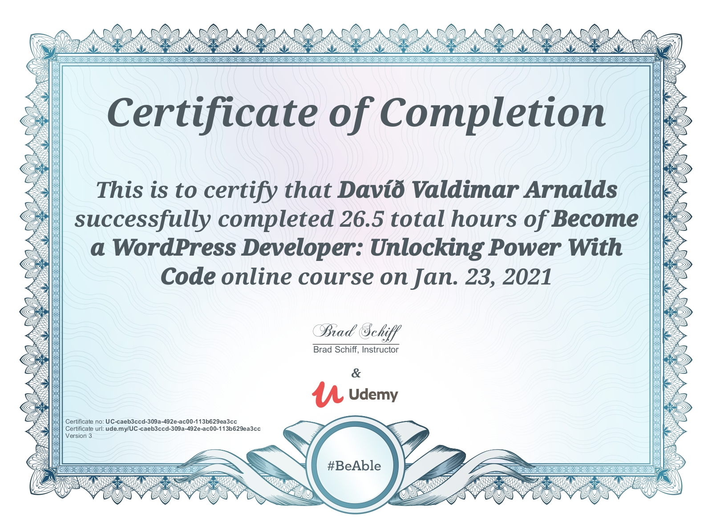

# Become a WordPress Developer: Unlocking Power With Code
All coursework for the Become a WordPress Developer: Unlocking Power With Code by Brad Schiff.

[The Course at Udemy](https://www.udemy.com/course/become-a-wordpress-developer-php-javascript/)  

## Curriculum

- [x] Section 01 - Welcome!
- [x] Section 02 - Getting Started
- [x] Section 03 - First Coding Steps: PHP
- [x] Section 04 - WordPress Specifig PHP
- [x] Section 05 - Pages
- [x] Section 06 - Building the Blog Section
- [x] Section 07 - Workflow and Automation
- [x] Section 08 - Events Post Type
- [x] Section 09 - Programs Post Type
- [x] Section 10 - Professors Post Type
- [x] Section 11 - Cleaner Code (Less Duplication)
- [x] Section 12 - Campus Post Type
- [x] Section 13 - Live Search (UI JavaScript)
- [x] Section 14 - WordPress REST API (AJAX)
- [x] Section 15 - Customizing the REST API
- [x] Section 16 - Combining Front-End & Back-End
- [x] Section 17 - Non-JS Fallback Traditional Search
- [x] Section 18 - User Roles and Permissions
- [x] Section 19 - User Generated Content
- [x] Section 20 - Like or "Heart" Count for Professors
- [x] Section 21 - Going Live: Deploying Our WordPress Site
- [x] Section 22 - Extra Credit Challenges & Topics
- [x] Section 23 - Gutenberg Block Editor Essentials
- [x] Section 24 - Final Chapter
